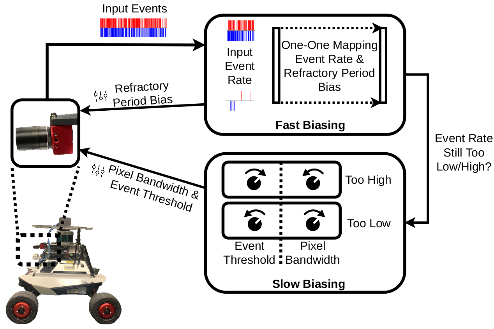

# Enhancing Visual Place Recognition via Fast and Slow Adaptive Biasing in Event Cameras

[](https://www.youtube.com/watch?v=8D9gtHqteEQ) [](https://gokulbnr.github.io/publication/dvs-biasing-vpr) [](https://huggingface.co/datasets/gokulbnr/QCR-Fast-Slow-Event-Dataset) [](https://arxiv.org/abs/2403.16425)

Welcome to the official repository for the paper [**Enhancing Visual Place Recognition via Fast and Slow Adaptive Biasing in Event Cameras**](https://arxiv.org/abs/2403.16425), to be presented at the 2024 IEEE/RSJ International Conference on Intelligent Robots and Systems (IROS 2024). This work introduces feedback control algorithms that dynamically change bias parameters for event-cameras to stabilize event-rate in an online manner. The work reports improvements in visual place recognition performances across variations in environment brightness conditions, validated through comprehensive real-time evaluations using a new [QCR-Fast-and-Slow-Event-Dataset](https://huggingface.co/datasets/gokulbnr/QCR-Fast-Slow-Event-Dataset).

<table>
  <tr>
    <td></td>
    <td></td>
    <td></td>
  </tr>
  <tr>
    <td style="text-align: center;">With Default Biases</td>
    <td style="text-align: center;">Our Bias Control Approach</td>
    <td style="text-align: center;">With Proposed Approach</td>
  </tr>
</table>

## Getting Started with Mamba
Borrowing the story from [Robostack](https://robostack.github.io/GettingStarted.html): To get started with conda (or mamba) as package managers, you need to have a base conda installation. Please do not use the Anaconda installer, but rather start with miniforge that is much more "minimal" installer. This installer will create a "base" environment that contains the package managers conda and mamba. After this installation is done, you can move on to the next steps.

When you already have a conda installation you can install mamba with:
```bash
conda install mamba -c conda-forge

```

## Code and Environment Setup
```bash
git clone git@github.com:gokulbnr/fast-slow-biased-event-vpr.git
cd fast-slow-biased-event-vpr
mamba env create -f environment.yaml
pip install git+ssh://git@github.com/gokulbnr/tonic.git@develop
```

## Fast and Slow Biasing of Event Cameras (During Dataset Collection)
We make use of a ROS1 node `fast_and_slow_controller` to update Event-Camera bias parameters in a online manner. This node has to run with [jAER](https://github.com/SensorsINI/jaer)v1.9.5 with [unicast datagram (UDP) output enabled](https://docs.google.com/document/d/1fb7VA8tdoxuYqZfrPfT46_wiT1isQZwTHgX8O22dJ0Q/edit#heading=h.9zam901lyzxx).

#### Prerequisite: [jAER](https://github.com/SensorsINI/jaer)
To sort out your dependencies for jAER, please use its [user guide](https://docs.google.com/document/d/1fb7VA8tdoxuYqZfrPfT46_wiT1isQZwTHgX8O22dJ0Q/edit#heading=h.ukkzt7422992). The proposed approach has been rigorously tested on devices running Ubuntu 20 and Ubuntu 22, both utilizing x86_64 architecture. The instructions to setup jAER up is as follows: 
```bash
git clone git@github.com:SensorsINI/jaer.git
cd jaer
git checkout 1.9.5
time ant jar
```

#### Setting up Fast and Slow Bias Controller ROS Node
```bash
cd fast-slow-biased-event-vpr
mkdir -p ~/catkin_ws/src/
mv fast_and_slow_controller_ros ~/catkin_ws/src/
cd ~/catkin_ws/src/
mamba activate evpr
catkin build
```

#### Dataset Collection
The event streams were recorded using the [jAER](https://github.com/SensorsINI/jaer)v1.9.5 library for a [DAVIS346Red](https://inivation.com/wp-content/uploads/2019/08/DAVIS346.pdf) device. jAER was run with [unicast datagram (UDP) output enabled](https://docs.google.com/document/d/1fb7VA8tdoxuYqZfrPfT46_wiT1isQZwTHgX8O22dJ0Q/edit#heading=h.9zam901lyzxx) to ensure UDP communication between the `fast_and_slow_controller` ROS node and jAER is enabled. To run the ROS node: 
```bash
cd ~/catkin_ws/
source devel/setup.bash
rosrun fast_and_slow_controller_ros fast_and_slow_controller
```

## Data Processing
Link to the released dataset: https://huggingface.co/datasets/gokulbnr/QCR-Fast-Slow-Event-Dataset

The dataset contains raw DVS data in [AEDAT2.0](https://gitlab.com/inivation/docs/-/blob/master/source/software/software-advanced-usage/file-formats/aedat-2.0.md?ref_type=heads) format and ground truth poses of the moving camera (pose of robot on which the DAVIS346Red camera is mounted) as tf2 transforms in rosbag files. To process raw data from traverses into geotagged image sequences, please use `scripts/process_data.sh`.
```bash
mamba activate evpr
cd fast-slow-biased-event-vpr/event_vpr
bash scripts/process_data.sh <experiment_name> <iteration_number> <path_to_experiment_home> <save_path_for_processed_data>
```

## Visual Place Recognition (Testing Data on Downstream Task)
We tested with Sum of Absolute Differences (SAD) to perform similarity computations between reference and query sets.
```bash
mamba activate evpr
cd fast-slow-biased-event-vpr/event_vpr
bash scripts/run_vpr.sh <experiment_name> <save_path_for_results> <path_to_processed_data_root_directory> <brightness_condition>
```
The `experiment_names` follow the same nomenclature as that in the main tables of the [paper manuscript](https://arxiv.org/abs/2403.16425). `PxBw`, `PxTh`, `RfPr` were available within jAER in the list of Filters (bottom left tab on the GUI). They are available under the DVSBiasController Filter in jAER. `default_params` corresponds to jAER's constant bias settings when `photoreceptor bandwidth`, `event threshold`, and `max pixel firing rate` parameters are all at 0. These parameters can be found under "User Friendly Settings" within "HW Configuration" (bottom left tab on GUI). `Fast_Slow` corresponds to results using our Fast and Slow Bias Controller. Here's a list of permitted values for arguments `<data_root>`, `<experiment_name>`, `brightness_condition`, and `iteration`. 
| Data Root Directory Names       | Experiment Names          | Brightness Conditions  | Number of iterations |
|:---------------------------------:|:---------------------------:|:------------------------:|:---------------------:|
| main_experiments                | Fast_Slow                 | low, medium, high      | 5                    |
|                                 | default_params            | low, medium, high      | 5                    |
|                                 | PxBw                      | low, medium, high      | 5                    |
|                                 | PxTh                      | low, medium, high      | 5                    |
|                                 | RfPr                      | low, medium, high      | 5                    |
| ablation_study_components       | constant                  | low, medium, high      | 3                    |
|                                 | fast                      | low, medium, high      | 3                    |
|                                 | slow                      | low, medium, high      | 3                    |
| ablation_study_slow_changes_freq| n2                        | low, medium, high      | 3                    |
|                                 | n7                        | low, medium, high      | 3                    |
|                                 | n10                       | low, medium, high      | 3                    |

## Cite us at
```
@inproceedings{nair2024enhancing,
  title={Enhancing Visual Place Recognition via Fast and Slow Adaptive Biasing in Event Cameras},
  author={Nair, Gokul B and Milford, Michael and Fischer, Tobias},
  booktitle={Proceedings of the IEEE/RSJ International Conference on Intelligent Robots and Systems (IROS)},
  year={2024}
}
```

## License

This project is licensed under the MIT License. See the [LICENSE](LICENSE) file for details.
